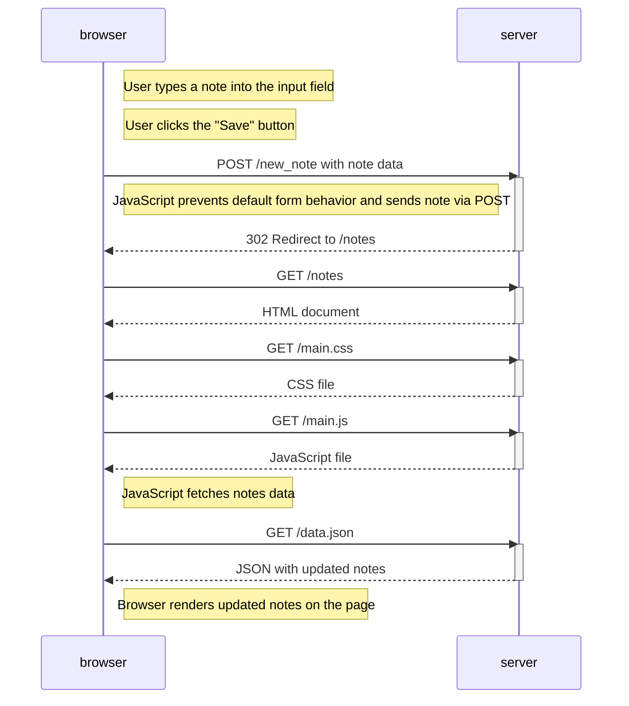

```mermaid
sequenceDiagram
    participant browser
    participant server

    Note right of browser: User types a note into the input field

    Note right of browser: User clicks the "Save" button

    browser->>server: POST /new_note with note data
    activate server
    Note right of browser: JavaScript prevents default form behavior and sends note via POST
    server-->>browser: 302 Redirect to /notes
    deactivate server

    browser->>server: GET /notes
    activate server
    server-->>browser: HTML document
    deactivate server

    browser->>server: GET /main.css
    activate server
    server-->>browser: CSS file
    deactivate server

    browser->>server: GET /main.js
    activate server
    server-->>browser: JavaScript file
    deactivate server

    Note right of browser: JavaScript fetches notes data

    browser->>server: GET /data.json
    activate server
    server-->>browser: JSON with updated notes
    deactivate server

    Note right of browser: Browser renders updated notes on the page
```
