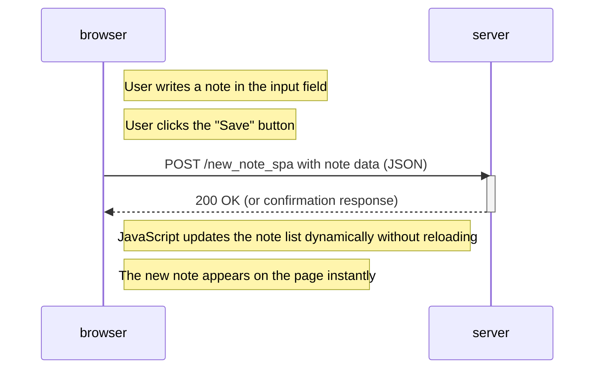

# 📝 Sequence Diagram: Creating a New Note in the SPA Version

This diagram shows what happens when the user creates a new note on the SPA version of the notes app at [`https://studies.cs.helsinki.fi/exampleapp/spa`](https://studies.cs.helsinki.fi/exampleapp/spa).

