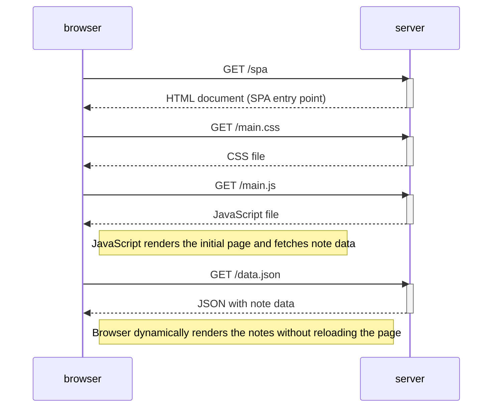

# 🌐 Sequence Diagram: Opening the Single Page App (SPA) Notes App

This diagram shows what happens when the user opens the Single Page App (SPA) version of the notes app at [`https://studies.cs.helsinki.fi/exampleapp/spa`](https://studies.cs.helsinki.fi/exampleapp/spa).

